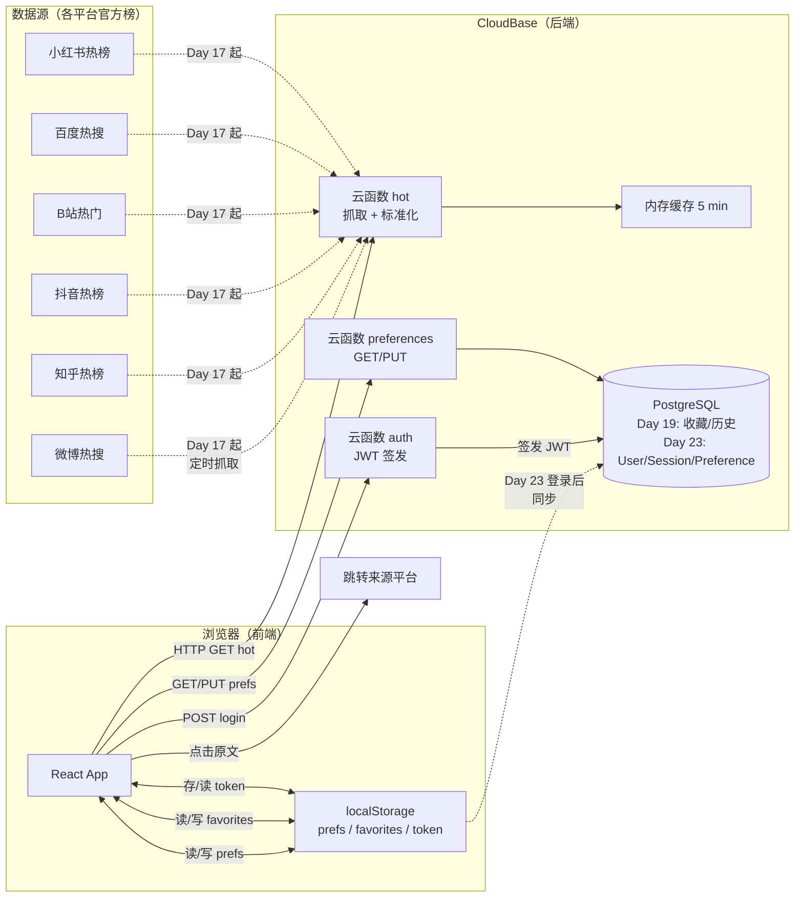

# TECH_DESIGN：热浪 TREND WAVE · 多平台热搜聚合站

> 依据：`PRD.md` v0.2（Day 5 共创）+ `research.md`（Day 3）。
> 范围：技术选型、数据流、项目结构、数据模型、API、错误处理、环境变量、迁移。
> 性质：可以替换任何具体实现，但**选型必须有理由**。
> 版本：v0.2（Day 5 共创修订；对应 PRD v0.2）。

---

## 一、技术选型（方案比较 → 推荐）

### 1.1 前端

| 方案 | 学习成本 | 体验 | 部署难度 | 取舍 |
|---|---|---|---|---|
| **React 18 + Vite 5 + Tailwind**（推荐） | 中 | 极佳 | 低 | 生态最大、教程最多；Vite 启动 1 秒；Tailwind 让"搭好看"的门槛降低 |
| Vue 3 + Vite + Tailwind | 中 | 佳 | 低 | 学习曲线更友好，但中文 vibecoding 教程 React 占多数；切换也行 |
| 纯 HTML/CSS/JS | 低 | 一般 | 最低 | 适合只做静态页；本项目有 4 个视图 + 登录态 + 个性化持久化，纯 HTML 状态管理难维护 |

**推荐**：React 18 + Vite 5 + Tailwind。

### 1.2 后端（数据采集 + API + 登录）

| 方案 | 国内访问 | 运维 | 费用 | 排错难度 |
|---|---|---|---|---|
| **CloudBase 云函数**（推荐） | 快 | 零运维 | 免费额度够 MVP | 低 |
| Vercel Serverless | 不稳（境外） | 零运维 | 免费额度够 | 中 |
| 自购云服务器 + Express | 自由 | 自己装环境 | 月费 + 备案 | 高 |

**推荐**：CloudBase Node.js 18 云函数。

### 1.3 数据库

| 方案 | 数据形态匹配 | 学完可迁移 | 费用 |
|---|---|---|---|
| **CloudBase PostgreSQL**（推荐） | 关系型 | ✅ 平移任何 RDBMS | 免费额度够 |
| CloudBase MongoDB | 文档型 | ⚠️ 学完只算半个通用技能 | 免费额度够 |
| 本地 SQLite | 同 PostgreSQL | ✅ | 零 |

**推荐**：CloudBase PostgreSQL。

### 1.4 部署

**推荐**：CloudBase 静态网站托管。

### 1.5 身份认证（Day 5 新增决策）

| 方案 | 实现难度 | 安全 |
|---|---|---|
| **JWT + bcrypt 哈希**（推荐） | 中 | 工业标准，无状态 token，7 天过期可控 |
| Cookie Session（服务端存） | 高 | CloudBase 无状态函数不太友好 |
| 第三方 OAuth（GitHub/微信） | 高 | MVP 用户少不值 |

**推荐**：JWT + bcrypt。
- 密码 `bcryptjs` 哈希
- 登录成功后签发 JWT，含 `userId` + `exp`（7 天）
- token 存 localStorage，HTTP Header `Authorization: Bearer ...`

---

## 二、推荐技术栈（一句话）

**前端 React 18 + Vite 5 + Tailwind → 后端 CloudBase Node.js 18 云函数 → 数据库 CloudBase PostgreSQL → 认证 JWT → 部署 CloudBase 静态托管；数据采集先 mock（Day 7–16），Day 17 起云函数定时抓真实接口；收藏 + 个性化偏好 localStorage 起步，登录后同步 PostgreSQL。**

---

## 三、项目结构（Day 7 起生效）

```
Project1/
├── index.html               # Vite 入口
├── src/
│   ├── main.jsx
│   ├── App.jsx              # 顶层路由 + 登录态 context
│   ├── pages/
│   │   ├── Home.jsx         # V1 3 列布局
│   │   ├── Detail.jsx       # V2 详情页
│   │   ├── Favorites.jsx    # V3 我的收藏
│   │   └── Login.jsx        # V4 登录弹窗/页
│   ├── components/
│   │   ├── PlatformPicker.jsx  # F2 6 选 3
│   │   ├── CategoryTags.jsx    # F3 6 类标签
│   │   ├── Column3.jsx         # F1 每列 10 + 展开 40
│   │   ├── HotItem.jsx         # 含 ⭐ 收藏 + category
│   │   └── SearchBox.jsx       # F3 关键字筛选
│   └── lib/
│       ├── api.js           # 调用云函数 + JWT header
│       ├── storage.js       # localStorage 封装（prefs + favorites + token）
│       └── auth.js          # 登录态 / 7 天免密判定
├── api/                     # CloudBase 云函数
│   ├── hot/                 # GET /api/hot（6 平台）
│   ├── favorite/            # POST/DELETE/GET /api/favorite
│   ├── auth/                # POST /api/auth/login, POST /api/auth/logout
│   └── preferences/         # GET/PUT /api/preferences
├── db/
│   └── schema.sql           # 5 张表 + 索引
├── PRD.md
├── TECH_DESIGN.md           # 本文件
├── research.md
├── AGENTS.md
└── .gitignore
```

---

## 四、数据模型

### 4.1 HotItem（热搜条目）

| 字段 | 类型 | 说明 |
|---|---|---|
| id | string | 唯一标识，格式 `平台_yyyymmdd_序号` |
| platform | enum | `weibo` / `zhihu` / `douyin` / `bilibili` / `baidu` / `xiaohongshu` |
| rank | int | 当前排名 |
| title | string | 热搜标题 |
| hotValue | number | 热度值 |
| tag | string? | 状态标签（沸/新/爆） |
| **category** | **enum** | **`ent` / `soc` / `tech` / `fin` / `sport` / `game`** |
| url | string | 原文链接 |
| updatedAt | datetime | 更新时间 |

### 4.2 Favorite（收藏）

| 字段 | 类型 | 说明 |
|---|---|---|
| id | uuid | 主键 |
| userKey | string | 未登录用户的浏览器本地 ID（替代账号） |
| userId | int? | 登录后改为 `userId`（nullable） |
| itemId | string | 对应的 HotItem.id |
| savedAt | datetime | 收藏时间 |

**索引**：`(userKey, itemId)` / `(userId, itemId)`

### 4.3 User（用户，Day 23 起启用）

| 字段 | 类型 | 说明 |
|---|---|---|
| id | serial | 主键 |
| username | string(32) | 唯一 |
| passwordHash | string(60) | bcrypt 哈希（**不存明文**） |
| createdAt | datetime | 创建时间 |

### 4.4 UserSession（会话，Day 23 起启用）

| 字段 | 类型 | 说明 |
|---|---|---|
| token | string(64) | JWT（主键） |
| userId | int | 关联 User.id |
| expiresAt | datetime | 过期时间（= issuedAt + 7 天） |

**索引**：`expiresAt`（用于过期清理）

### 4.5 Preference（个人偏好，Day 23 起启用）

| 字段 | 类型 | 说明 |
|---|---|---|
| userId | int | 主键 |
| selectedPlatforms | string[] | 选中的平台数组（最多 3 个） |
| selectedCategories | string[] | 选中的标签数组（可空 = 全部） |
| updatedAt | datetime | 上次修改时间 |

---

## 五、API 列表

### 5.1 数据类（核心）

| 方法 | 路径 | 入参 | 出参 |
|---|---|---|---|
| GET | `/api/hot` | `platforms?`（逗号分隔） | `{items: HotItem[], updatedAt}` |
| GET | `/api/hot/:id` | — | `HotItem` |

### 5.2 收藏类（登录可用，未登录走 localStorage）

| 方法 | 路径 | 入参 | 出参 |
|---|---|---|---|
| GET | `/api/favorite` | — | `HotItem[]` |
| POST | `/api/favorite` | `{itemId}` | `{ok: true}` |
| DELETE | `/api/favorite/:itemId` | — | `{ok: true}` |

### 5.3 认证类（Day 23）

| 方法 | 路径 | 入参 | 出参 |
|---|---|---|---|
| POST | `/api/auth/login` | `{username, password}` | `{token, expiresAt, user: {id, username}}` |
| POST | `/api/auth/logout` | — | `{ok: true}` |
| GET | `/api/auth/me` | — | `{user}` 或 `401` |

### 5.4 偏好类（Day 23，需 Authorization header）

| 方法 | 路径 | 入参 | 出参 |
|---|---|---|---|
| GET | `/api/preferences` | — | `{selectedPlatforms, selectedCategories, updatedAt}` |
| PUT | `/api/preferences` | `{selectedPlatforms, selectedCategories}` | `{ok: true}` |

**所有需认证接口**：Header `Authorization: Bearer <token>`；token 过期返回 401，前端跳转登录。

---

## 六、前后端数据流（含个性化 + 登录）



**对应 PRD 每个动作**：

| F | 数据走向 |
|---|---|
| F1 打开首页 | 浏览器 → `GET /api/hot?platforms=...` → 渲染 3 列 |
| F2 改平台选择 | 写 localStorage；登录后 PUT `/api/preferences` |
| F3 改标签筛选 | 写 localStorage；登录后 PUT `/api/preferences` |
| F3 启动恢复 | 读 localStorage；登录后 GET `/api/preferences` 覆盖 |
| F4 点详情 | 列表缓存里取 |
| F5 收藏 | 写 localStorage；登录后 POST `/api/favorite` |
| F6 登录 | POST `/api/auth/login` → 存 token → GET `/api/preferences` 覆盖本地 |
| F6 自动登录 | 启动读 token，未过期则跳过登录页 |
| F6 退出 | POST `/api/auth/logout` → 清本地 token + prefs |

---

## 七、错误处理

### 7.1 后端

| 场景 | 处理 |
|---|---|
| 抓取某平台失败 | 返回上次缓存 + `stale: true` |
| 3 次连续失败 | HTTP 503 + `retryAfter: 60` |
| 单平台空数据 | `{items: [], empty: true}`，不报错 |
| 数据库连接失败 | 写操作降级为 localStorage（用户无感） |
| 登录密码错误 | HTTP 401 + `{"error": "invalid_credentials"}` |
| Token 过期 | HTTP 401 + `{"error": "token_expired"}` |
| 偏好写入冲突 | last-write-wins |

### 7.2 前端

| 场景 | 用户看到 |
|---|---|
| HTTP 5xx | 「加载失败」+ 重试按钮 |
| HTTP 401 + token_expired | 「请重新登录」弹窗 |
| HTTP 401 + invalid_credentials | 「账号或密码错误」 |
| localStorage 写失败 | 提示「本机存储失败，刷新后丢失」 |

---

## 八、环境变量

`.env.example` 模板（`.env` 不进仓库）：

```bash
# CloudBase
CLOUDBASE_ENV_ID=
CLOUDBASE_SECRET_ID=
CLOUDBASE_SECRET_KEY=

# PostgreSQL（Day 19 起）
DATABASE_URL=

# 认证（Day 23 起）
JWT_SECRET=                # 至少 32 字符随机串
JWT_EXPIRES_IN=604800     # 7 天 = 604800 秒
```

**安全约束**：
- `.env` 在 `.gitignore` 第 2 行，已被忽略
- 任何 commit 前用 `git check-ignore -v .env` 验证
- JWT_SECRET 不要进代码、不要进提交、不要进截图
- 密码哈希也不进截图

---

## 九、迁移注意事项

| 阶段 | 迁移内容 | 注意事项 |
|---|---|---|
| Day 7 mock → 真实接口 | 仅改 hot 云函数 | 先接 1 个平台验证 |
| Day 19 localStorage favorites → PostgreSQL | 旧收藏数据留在浏览器新表 | 登录后才会有 DB 数据，无需兼容 |
| Day 19 起上 PostgreSQL 历史表 | 不影响前端 | 历史表独立 |
| Day 23 加入登录 | User/Session/Preference 表首次有写入 | localStorage 中的 prefs 在首次登录时合并到 DB |
| Day 28 v1.0 上线 | 域名/备案/性能压测 | CloudBase 自动 HTTPS |

---

## 十、未决定 / 待定

| 项 | 原因 | 何时定 |
|---|---|---|
| 数据抓取调度（定时触发 vs 首次访问触发） | Day 17 才接真实接口 | Day 17 |
| 6 个平台中哪些真实接口可访问 | 各家反爬政策不同 | Day 17 |
| PostgreSQL 是否需要每日历史表 | Day 19 起才有写入 | Day 19 |
| CloudBase 是否升级付费版 | 免费额度待评估 | 上线前 |
| category 字段从哪里来 | 各平台不公开标签，需后端规则分类 | Day 17（先用关键词规则粗分） |

---

## 附：AI 自检记录

| 检查项 | v0.1 | v0.2（Day 5 共创后） |
|---|---|---|
| 必含 8 板块 | ✅ | ✅ |
| 比较 2–3 套方案后再推荐 | ✅ | ✅（+ 认证方案比较） |
| 推荐路线有理由 | ✅ | ✅ |
| 数据流图说清数据从哪来、到哪去 | ✅ | ✅（含登录 + 偏好同步路径） |
| 每个 MVP 动作都有 API 或本地替代 | ✅ | ✅（F1–F7 全部对应） |
| 线上数据库持久化有说明 | ✅ | ✅（5 张表） |
| 未决定项已标注 | ✅ | ✅ |
| 不含凭空创建的文件 | ✅ | ✅ |